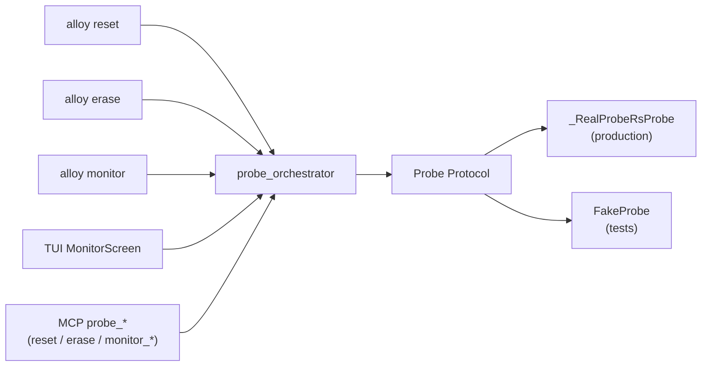

# Probe orchestrator

The probe orchestrator is the [toolchain
orchestrator](toolchain-orchestrator.md)'s sibling for hardware
operations.  Same pattern — one walker every entry point
dispatches through — different domain.  It owns probe selection,
binary resolution from `.alloy/toolchain.lock`, subprocess argv
assembly, and the typed-error vocabulary for every Wave-4 verb.

## The fan-in



Three CLI verbs, one TUI screen, six MCP tools — all routed
through one place.

## Public surface

```python
from alloy_cli.core.probe_orchestrator import (
    select_probe,           # USB enumerate + filter
    real_probe_for,         # build a _RealProbeRsProbe for an identity
    reset_target,           # ResetMethod.{SOFT, HARD}
    plan_erase,             # read-only preview
    execute_erase,          # mutating
    open_monitor,           # streaming session
)
```

Plus the `Probe` Protocol that backends implement, and the
`FakeProbe` test seam that records every call + emits scripted
`MonitorEvent`s.

## Sealed event union

The streaming side (`open_monitor`) emits one of three events:

- `MonitorOpened(probe, port, baud, mode, started_at_ms)`
- `MonitorBytes(chunk, timestamp_ms)`
- `MonitorClosed(duration_ms, bytes_captured, last_line)`

Tests pin the closed nature of the union (no fourth variant).
Adding a new variant is a Wave-5 concern.

## The vendor-probe contract

Vendor-only probes (proprietary J-Link with locked firmware,
ST-Link/V3 with vendor protocol) raise
`FamilyToolchainProbeUnauthorisedError` on `select_probe`.  The
orchestrator NEVER auto-invokes the vendor utility.  The error
carries:

- `vendor_tool` — the canonical utility name (`"J-Link
  Commander"`).
- `install_doc_url` — where to download it manually.

Surfaces render that information; agents read it via the typed
MCP envelope.

## Cancellation

Ctrl+] in `alloy monitor` raises
`ProbeOperationCancelledError(duration_ms, bytes_captured,
last_line)`.  The CLI exits 0 (graceful disconnect, not a
failure) and prints a one-line summary.

For MCP, the session-style monitor (`probe_monitor_open` →
`probe_monitor_poll` → `probe_monitor_close`) auto-closes after
5 minutes of poll inactivity so a crashed agent never leaks
threads.

## Where it lives

| File | Role |
|---|---|
| `src/alloy_cli/core/probe_orchestrator.py` | Walker + Probe Protocol + FakeProbe + _RealProbeRsProbe + MonitorSessionTable |
| `src/alloy_cli/commands/{reset,erase,monitor}.py` | Three CLI entry points |
| `src/alloy_cli/tui/screens/monitor.py` | TUI MonitorScreen |
| `src/alloy_cli/mcp/tools.py` | Six MCP probe tools |
| `tests/test_probe_orchestrator.py` | Orchestrator scenarios |
| `tests/test_probe_orchestrator_contract.py` | "Every entry point dispatches through `probe_orchestrator`" |

## Cross-references

- [`docs/RECOVERY.md`](../RECOVERY.md) — the full reference for
  `alloy reset` / `alloy erase` / `alloy monitor`.
- [Two-phase mutations](two-phase-mutations.md) — why
  `probe_erase` requires `confirm=true`.
- [Toolchain orchestrator](toolchain-orchestrator.md) — the
  sibling pattern this one mirrors.
