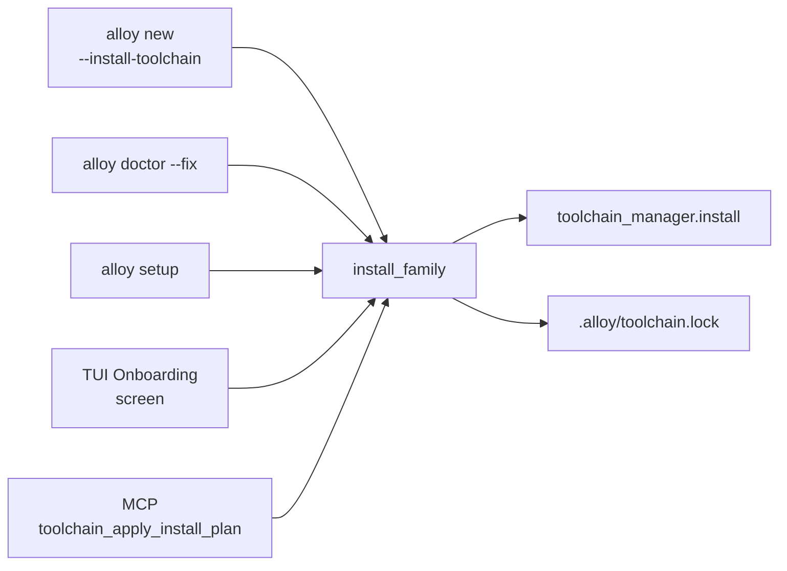

# Toolchain orchestrator

The toolchain orchestrator is the **single seam** every "install
the toolchain" entry point dispatches through.  It lives at
`alloy_cli.core.toolchain_orchestrator.install_family` and owns
the tier walk + vendor short-circuit + lockfile update + typed
event stream.

## The fan-in problem

Wave 2 shipped a content-addressed tool installer; Wave 3 had to
expose it through five surfaces:



Without one walker, "did vendor short-circuit fire?", "did the
lockfile update?", "what's the partial-progress on cancellation?"
would diverge between surfaces.  With the orchestrator, every
surface reads the same `InstallReport`.

## The contract

```python
report = install_family(
    manifest,                       # FamilyManifest from toolchain_registry
    *,
    project_root=None,              # None → no lockfile update
    include_optional=False,
    force=False,
    on_event=None,                  # Callable[[InstallEvent], None]
    downloader=None,                # FakeDownloader in tests
)
```

The `on_event` callback receives a typed `InstallEvent`:

| Event | When |
|---|---|
| `ToolStarted` | Adapter resolved the artefact; install about to begin |
| `ToolDownloaded` | Bytes finalised + SHA verified |
| `ToolInstalled` | Atomic promotion done; lockfile pin staged |
| `ToolFailed` | Typed install error — walker continues |
| `ToolSkippedVendor` | Vendor (EULA-gated) tool — never auto-installed |
| `ToolSkippedHostUnsupported` | Active host has no pin |

## Architectural invariants

- **UI-free**: zero Click / Rich / Textual / `input()` /
  `sys.stdin` references.  Verified by an AST-based contract test
  (`tests/test_toolchain_orchestrator.py`).
- **Per-tool failure isolation**: `family-toolchain-installer-
  checksum` on tool N does NOT abort tools N+1.  Each row
  surfaces its `state` independently.
- **Vendor short-circuit**: vendor tools (STM32CubeProgrammer,
  nrfjprog, J-Link) emit `ToolSkippedVendor` with the
  `install_doc_url` populated.  No download spawned.
- **Lockfile update is conditional**: only fires when
  `project_root` is set AND at least one tool actually installed.
  A `--shared` install (passing `project_root=None`) populates
  the global store without touching any lockfile.

## Where it lives

| File | Role |
|---|---|
| `src/alloy_cli/core/toolchain_orchestrator.py` | The walker + every typed dataclass |
| `src/alloy_cli/commands/_install_view.py` | Shared Rich rendering (`render_install_plan` / `make_event_logger`) |
| `tests/test_toolchain_orchestrator.py` | 15 scenarios |
| `tests/test_toolchain_onboarding_contract.py` | "every entry point routes through `install_family`" guard |

## Cross-references

- [`docs/TOOLCHAIN_ONBOARDING.md`](../TOOLCHAIN_ONBOARDING.md) —
  the full reference for the four CLI/TUI entry points + the MCP
  apply tool.
- [`docs/TOOLCHAIN_INSTALLER.md`](../TOOLCHAIN_INSTALLER.md) —
  Wave 2's pin file format + content-addressed store.
- [Two-phase mutations](two-phase-mutations.md) — why the MCP
  `toolchain_apply_install_plan` tool requires a preview-then-
  apply dance.
