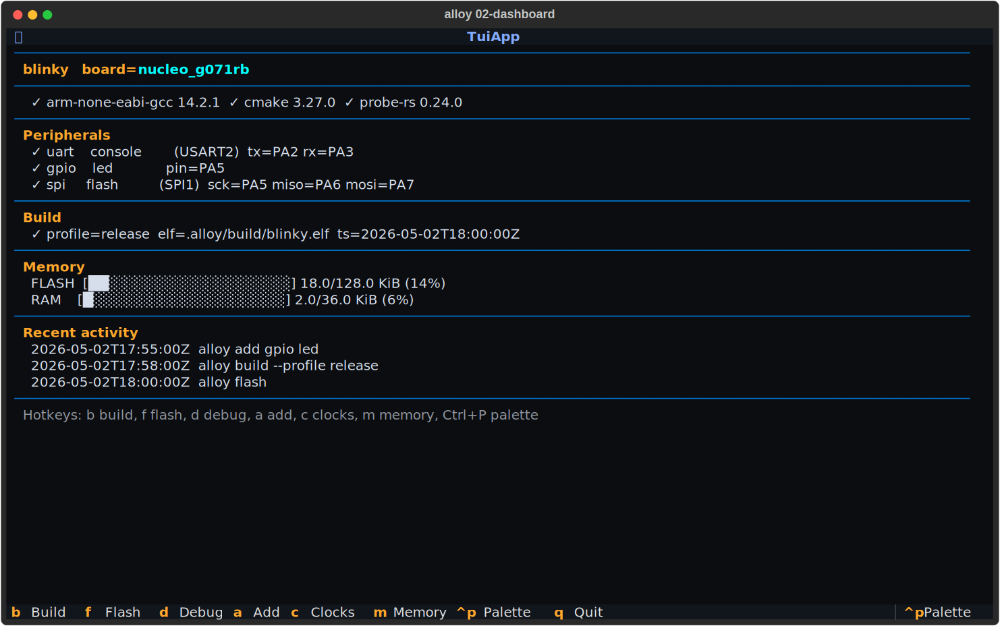
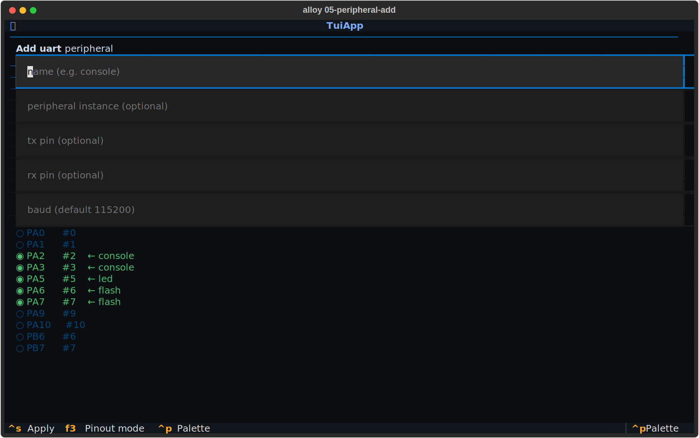
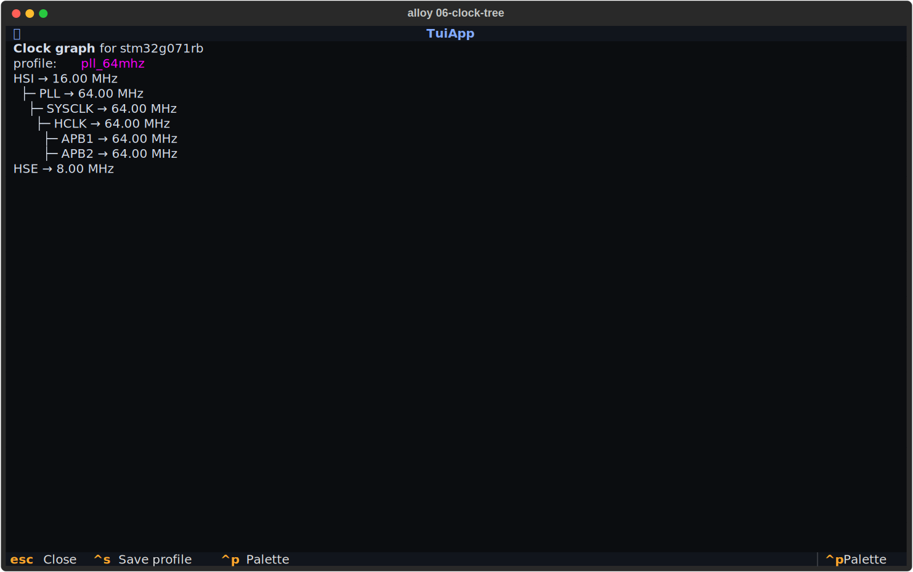

---
hide:
  - navigation
  - toc
title: alloy-cli — terminal-native firmware development
description: >-
  Scaffold, configure, build, flash, and debug embedded firmware
  projects from a single tool — with first-class AI-agent integration.
---

<div class="hero" markdown>

# alloy-cli

> **Embedded firmware development without the IDE.**
> Pin picker, clock-tree visualiser, build / flash / debug, AI-assisted
> scaffolding — all in your terminal, all from a single tool.

```bash
pip install alloy-cli
```

[Quickstart — 5 minutes to first ELF :material-rocket-launch:](QUICKSTART.md){ .md-button .md-button--primary }
[See it on GitHub :material-github:](https://github.com/Alloy-Embedded/alloy-cli){ .md-button }

</div>

---

## Why alloy-cli?

`alloy-cli` is the developer-facing surface of the **Alloy embedded
platform**.  It replaces the dance of CubeMX (GUI) → IDE (closed
project format) → vendor flasher (per-chip) → CMake (write-it-
yourself) with one tool that:

- **Scaffolds** a working project from a board or chip name.
- **Configures** peripherals (UART / SPI / I²C / TIM / DMA / clocks)
  through an interactive terminal pin picker that rivals CubeMX —
  with the difference that every choice is validated against a
  **typed, schema-locked device IR** at config time.
- **Builds, flashes, debugs** with toolchain auto-detection (probe-rs,
  OpenOCD, J-Link, ST-Link, picoprobe) — without a CMake line in
  sight.
- **Talks to LLM agents** (Claude Code, opencode, Cursor, Continue)
  natively via **MCP** so `> "blink the LED"` becomes a working,
  schema-valid project change.

---

## What you get

<div class="grid cards" markdown>

-   :material-rocket-launch:{ .lg .middle } &nbsp; **Scaffold in seconds**

    ---

    `alloy new firmware --board nucleo_g071rb` — answer **Y** when
    prompted and the toolchain installs into a per-user content-
    addressed store.  No PATH munging, no vendor IDE, no CMake
    boilerplate.

    [:octicons-arrow-right-24: Quickstart](QUICKSTART.md)

-   :material-cog-transfer:{ .lg .middle } &nbsp; **Validated configuration**

    ---

    Every pin, every clock, every DMA stream is checked against a
    typed device IR at config time.  Bad combinations fail with a
    structured diagnostic + suggested alternatives, not at link time.

    [:octicons-arrow-right-24: Configuration](PROJECT_FORMAT.md)

-   :material-robot-happy:{ .lg .middle } &nbsp; **AI-native workflow**

    ---

    The MCP surface exposes typed tools to Claude / opencode /
    Cursor.  Two-phase mutations (preview → apply) keep agent
    suggestions safe; typed errors guide them to the right answer.

    [:octicons-arrow-right-24: AI integration](AI_INTEGRATION.md)

</div>

---

## See it in action

The TUI dashboard surfaces project state, build status, and memory
usage at a glance:



Add a peripheral with the IR-validated pin picker:



Inspect the clock tree without leaving the terminal:



---

## Where to go next

<div class="grid cards" markdown>

-   :material-school:{ .lg .middle } &nbsp; **New here?**

    ---

    The 5-minute Quickstart takes you from `pip install` to a
    flashed Nucleo blinking its on-board LED.

    [:octicons-arrow-right-24: Get started](QUICKSTART.md)

-   :material-tools:{ .lg .middle } &nbsp; **Cloned an existing project?**

    ---

    Run `alloy doctor --fix` to install the project's pinned
    toolchain into your local store.

    [:octicons-arrow-right-24: Toolchain onboarding](TOOLCHAIN_ONBOARDING.md)

-   :material-bug-check:{ .lg .middle } &nbsp; **Hit an error?**

    ---

    Every error in alloy-cli has a stable `error_type`.  The
    cookbook lists every one with recovery steps.

    [:octicons-arrow-right-24: Error cookbook](ERROR_COOKBOOK.md)

-   :material-bookshelf:{ .lg .middle } &nbsp; **Reference material?**

    ---

    Every CLI verb, every alloy.toml field, every MCP tool — the
    Reference section has it all.

    [:octicons-arrow-right-24: Cheatsheet](CHEATSHEET.md)

</div>

---

<div class="footer-note" markdown>

`alloy-cli` is open source under the MIT license.  See the
[Contributing guide](CONTRIBUTING.md) to propose changes, the
[Roadmap](ROADMAP.md) for what's next, and the
[Vision](VISION.md) for the bigger picture.

</div>
