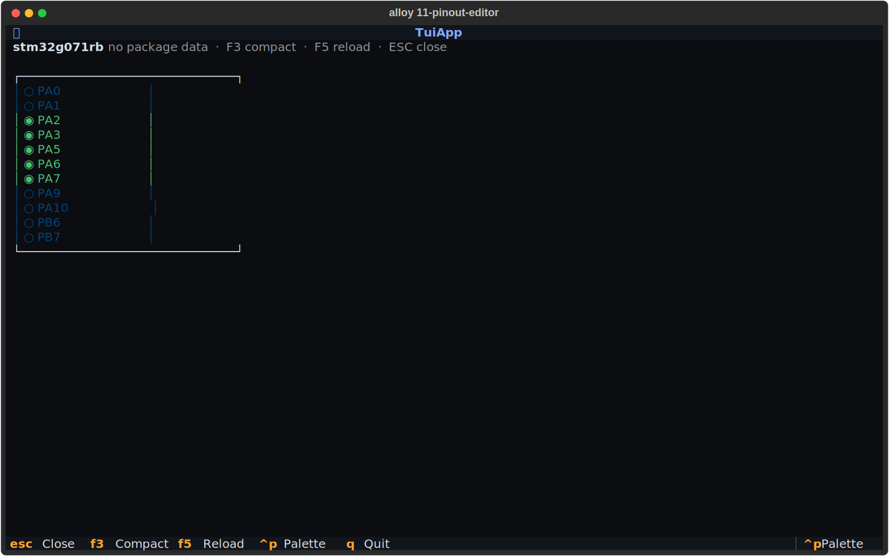
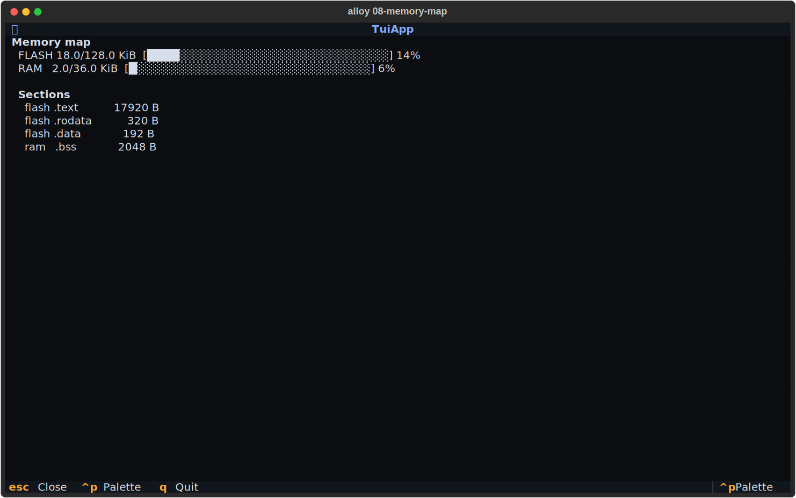

# TUI screens

`alloy ui` opens the terminal user interface — a full-screen Textual
application that lets you configure, build, and flash firmware without
typing individual commands.  Every screen is also reachable from the
command palette (**Ctrl+P**) so keyboard-first workflows stay fast.

```sh
alloy ui                    # open TUI (Dashboard on first launch)
```

---

## Pinout editor

The pinout editor shows the device's package schematic with live pin
assignment state, and lets you add peripherals interactively from the
same screen.

```sh
alloy ui                    # then Ctrl+P → "pinout-editor"
```



### What you see

| Glyph | Colour | Meaning |
|---|---|---|
| `◉` | green | Assigned — pin claimed by a peripheral in `alloy.toml` |
| `○` | dim | Free — available for assignment |
| `◆` | magenta | Candidate — legal pin for the signal currently being configured |
| `▣` | yellow | Reserved — power, ground, or debug pad |
| `✗` | red | Conflict — same pin claimed by two peripherals |

### Adding a peripheral

1. Press one of the **Add peripheral** buttons at the bottom of the
   screen (UART, SPI, I2C, GPIO, Timer, ADC, CAN, USB, ETH).
2. The **Peripheral Add** screen opens for the chosen kind — fill in
   the fields and press **Ctrl+S** to apply.
3. On close, `alloy.toml` is updated and the schematic reloads
   automatically so the newly assigned pins turn green.

### Keyboard reference

| Key | Action |
|---|---|
| **F3** | Toggle compact list ↔ schematic view |
| **F5** | Reload `alloy.toml` from disk (pick up external edits) |
| **ESC** | Close and return to the previous screen |

### Auto-discovery

The editor walks up from the current working directory to find
`alloy.toml`.  Run `alloy ui` from anywhere inside your project tree
and the editor opens the correct project automatically.  If no project
is found a placeholder is shown with instructions.

---

## Memory map

After a successful build, the memory map screen shows flash and RAM
usage as stacked bar charts, broken down by ELF section.

```sh
alloy build                 # build first
alloy ui                    # then Ctrl+P → "memory-map"
```



### What you see

```
FLASH  18.0/128.0 KiB  [████░░░░░░░░░░░░░░░░░░░░░░░░░░] 14%
RAM     2.0/ 36.0 KiB  [█░░░░░░░░░░░░░░░░░░░░░░░░░░░░░]  6%

Sections
  flash  .text           17920 B
  flash  .rodata           320 B
  flash  .data             192 B
  ram    .bss             2048 B
```

Capacities come from `board.json` (`flash_size_bytes` + `sram_size_bytes`).
Section sizes are read from the most-recently modified `*.elf` under
`.alloy/build/` via `arm-none-eabi-size`.

---

## Per-region erase

`alloy erase` supports erasing specific flash regions instead of the
whole chip.  Region aliases resolve via the device IR; raw address
ranges also work.

```sh
# Erase the whole chip (default)
alloy erase --auto

# Erase a named region (alias defined in the device IR)
alloy erase --region bootloader --auto

# Erase a literal address range
alloy erase --region 0x08000000-0x08010000 --auto

# Multiple regions in one command
alloy erase --region bootloader --region appslot-a --auto

# Dry-run: see the plan without erasing
alloy erase --region bootloader
```

!!! warning "Safety gates"
    Without `--auto` / `--yes`, the command shows the erase plan and
    asks for confirmation in an interactive TTY.  In CI always pass
    `--auto` or the command will refuse to run on a non-TTY stdin.

### Erase plan table

```
            Erase plan — board=nucleo_g071rb
 region        base          size
 ─────────────────────────────────────────
 bootloader    0x08000000    16.0 KiB
 appslot-a     0x08004000    48.0 KiB
```

The table is printed before the confirmation prompt so you can verify
the addresses before committing.

---

## Monitor

Stream UART output from the target directly to your terminal.  The
port is auto-detected from the board's `serial_globs` in `board.json`.

```sh
alloy monitor               # auto-detect port + baud from alloy.toml
alloy monitor --port /dev/cu.usbmodem1234
alloy monitor --baud 9600
alloy monitor --mode rtt    # RTT via probe-rs (requires probe connected)
```

Press **Ctrl+]** to disconnect cleanly.  On close, alloy prints the
byte count, session duration, and last line received:

```
Closed monitor session.  1024 bytes captured over 12.3s.
Last line: 'Hello from SAME70!'
```

### Auto-detect

Port detection requires a `[board]` entry in `alloy.toml` with
`serial_globs` declared in the board's `board.json`.  When multiple
ports match, the first is used and the others are listed so you can
override with `--port`.

### ANSI stripping

By default, ANSI escape sequences are stripped so the log stays
`grep`-friendly.  Pass `--ansi` to preserve colour output:

```sh
alloy monitor --ansi | grep ERROR
```

---

## Related commands

| Command | What it does |
|---|---|
| `alloy ui` | Open the full TUI |
| `alloy monitor` | Stream UART / RTT bytes from the target |
| `alloy erase` | Erase flash (chip-wide or per-region) |
| `alloy reset` | Soft or hard reset via the debug probe |
| `alloy flash` | Flash the ELF and reset |
| `alloy add uart` | Add a UART peripheral to `alloy.toml` |
| `alloy boards <id> --pinout` | Read-only package schematic (no project needed) |
